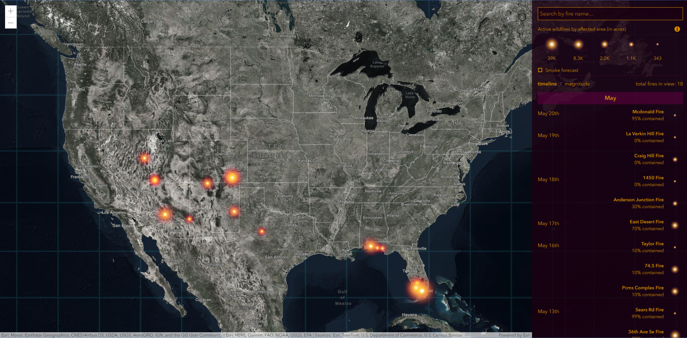

## Wildfire Viz App

This app presents active wildfires in the United States. The source for the locations is Integrated Reporting of Wildland-Fire Information (IRWIN) location database along with the polygon perimeters from the National Interagency Fire Center (NIFC). Both layers update every 15 minutes. .

[View it live](https://livingatlas.arcgis.com/wildfire/)



## Features
Fires are sorted by burn size (in the grid view) or age (in the timeline view). This application is an unofficial presentation of this data and is intended for reference only. 

## Instructions

- Before we begin, make sure you have a fresh version of [Node.js](https://nodejs.org/en/) and NPM installed. The current Long Term Support (LTS) release is an ideal starting point. 

- To begin, fork this repository and clone the fork to your computer:

    ```sh
    https://github.com/vannizhang/wildfire-viz-app.git
    ```

- From the project's root directory, install the required packages (dependencies):

    ```sh
    npm install
    ```

 - Now you can start the webpack dev server to test the app on your local machine:

    ```sh
    # it will start a server instance and begin listening for connections from localhost on port 8080
    npm run start
    ```

 - To build/deploye the app, you can simply run:

    ```sh
    # it will place all files needed for deployment into the /dist directory 
    npm run build
    ```


## Requirements

- [ArcGIS API for JavaScript (version 4.11)](https://developers.arcgis.com/javascript/index.html)
- [React.js](https://reactjs.org/)


## Resources

* [Using Firefly Symbol in ArcGIS Online](https://www.esri.com/arcgis-blog/products/arcgis-living-atlas/mapping/whats-new-in-arcgis-online-firefly/)
* [Using Firefly Symbol in ArcGIS Pro](https://www.esri.com/arcgis-blog/products/arcgis-pro/mapping/steal-this-firefly-style-please/)
* [Firefly Basemap](https://livingatlas.arcgis.com/en/browse/#d=1&q=%22World%20Imagery%20(Firefly)%22)
* The USA Wildfire Activity layer used by this app is available on [ArcGIS Living Atlas of the World](https://www.arcgis.com/home/item.html?id=d957997ccee7408287a963600a77f61f).

## Issues

Find a bug or want to request a new feature?  Please let us know by submitting an issue.

## Contributing

Esri welcomes contributions from anyone and everyone. Please see our [guidelines for contributing](https://github.com/esri/contributing).

## Licensing
Copyright 2020 Esri

Licensed under the Apache License, Version 2.0 (the "License");
you may not use this file except in compliance with the License.
You may obtain a copy of the License at

   http://www.apache.org/licenses/LICENSE-2.0

Unless required by applicable law or agreed to in writing, software
distributed under the License is distributed on an "AS IS" BASIS,
WITHOUT WARRANTIES OR CONDITIONS OF ANY KIND, either express or implied.
See the License for the specific language governing permissions and
limitations under the License.

A copy of the license is available in the repository's [license.txt](license.txt) file.