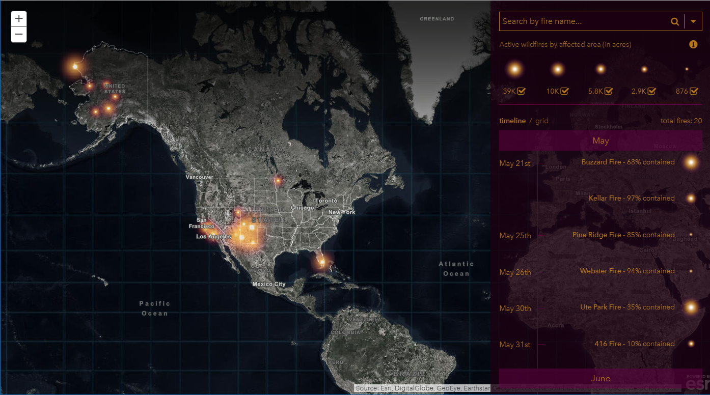

## Wildfire Viz App

This map presents active wildfires in the United States. The source for the locations and perimeters is GeoMAC, a multi-agency coordination including DOI, USGS, NIFC, RSAC, USFS, NASA, BLM, NGDC, and NOAA. Find more information, including GeoMAC credits and disclaimer, [here](https://www.geomac.gov/about.shtml).

[View it live](https://vannizhang.github.io/wildfire-viz-app/)

## Features
Fires are sorted by burn size (in the grid view) or age (in the timeline view). This application is an unofficial presentation of this data and is intended for reference only. 

## Requirements

- [ArcGIS API for JavaScript (version 3.24)](https://developers.arcgis.com/javascript/index.html)
- [jQuery](http://jquery.com/)

## Resources

* [Using Firefly Symbol in ArcGIS Online](https://www.esri.com/arcgis-blog/products/arcgis-living-atlas/mapping/whats-new-in-arcgis-online-firefly/)
* [Using Firefly Symbol in ArcGIS Pro](https://www.esri.com/arcgis-blog/products/arcgis-pro/mapping/steal-this-firefly-style-please/)
* [Firefly Basemap](https://livingatlas.arcgis.com/en/browse/#d=1&q=%22World%20Imagery%20(Firefly)%22)
* The USA Wildfire Activity layer used by this app is available on [ArcGIS Living Atlas of the World](https://livingatlas.arcgis.com/en/browse/#d=1&q=%22USA%20Wildfire%20Activity%22).

## Issues

Find a bug or want to request a new feature?  Please let us know by submitting an issue.

## Contributing

Esri welcomes contributions from anyone and everyone. Please see our [guidelines for contributing](https://github.com/esri/contributing).

## Licensing
Copyright 2016 Esri

Licensed under the Apache License, Version 2.0 (the "License");
you may not use this file except in compliance with the License.
You may obtain a copy of the License at

   http://www.apache.org/licenses/LICENSE-2.0

Unless required by applicable law or agreed to in writing, software
distributed under the License is distributed on an "AS IS" BASIS,
WITHOUT WARRANTIES OR CONDITIONS OF ANY KIND, either express or implied.
See the License for the specific language governing permissions and
limitations under the License.

A copy of the license is available in the repository's [license.txt](license.txt) file.